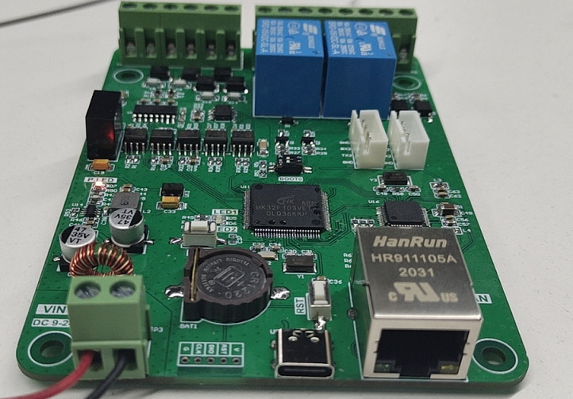
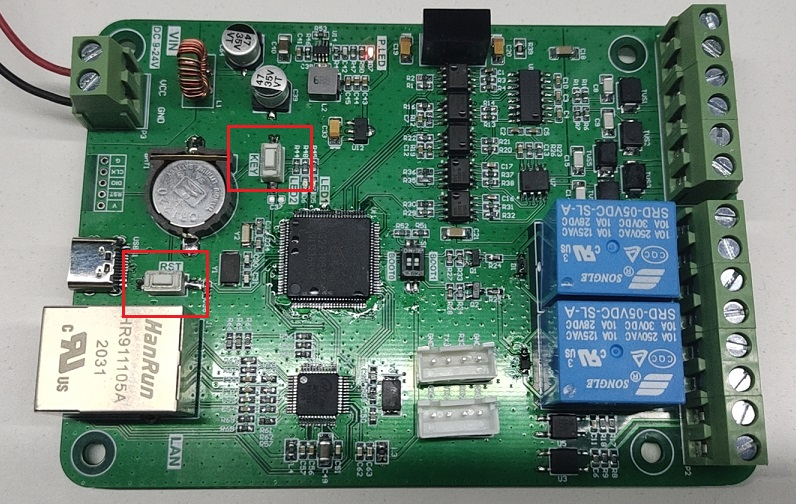

# TiGW1000-Lite版可编程边缘计算网关

## 产品介绍

TiGW1000是钛云物联开发的支持以太网网络的可编程边缘计算网关,它提供RS485、RS232、DI、DO等多种接口，可通过以太网将数据上报至云端,满足用户对设备的接入需求, 能够支持目前主流的网络接入协议和公有云平台，包括MQTT, COAP,以及阿里云、腾讯云、中国移动ONENET、中国电信AEP等等。

TiGW1000内置钛云物联自主知识产权的钛极OS(TiJOS)物联网操作系统，支持用户通过Java语言进行功能扩展，适用各种工况， 它强大的可编程功能允许用户根据项目需求通过Java语言开发相关所需的功能， 如串口通讯， 协议解析，上传云端等等。

TiGW1000提供了丰富的文档和例程，并提供了大量开源驱动，如MODBUS等，方便用户可以快速的完成所需功能。

TiGW1000-Lite是TiGW1000的简化版

 

## 产品特点

- 支持以太网LAN网络

- 支持1路RS485工业总线接入现场设备 

- 支持1路RS232工业总线接入现场设备 

- 支持2路TTL UART 接口

- 支持2路继电器

- 支持2路数字量输入

- 内置TiJVM Java虚拟机

- 支持用户进行功能扩展

- 支持通过Java语言进行设备协议解析及控制策略

- 提供标准协议库，如Modbus等等

- 用户可内置多个应用对应不同的应用场景

- 支持UDP, TCP, HTTP, MQTT, COAP等多种网络协议

- 支持多种云平台, 如电信云,华为云,阿里云、腾讯云等公有云, 以及用户私有云

  

## 产品规格

| 参数             | 说明                     |
| ---------------- | ------------------------ |
| 产品名称         | 可编程边缘计算网关       |
| 产品型号         | TiGW1000-Lite            |
| 工作电压         | 9-28V                    |
| 工作电流         | <100mA                   |
| 供电方式         | 直流电源                 |
| 网络传输方式     | 以太网                   |
| 有线传输方式     | 1路RS485支持32个设备连接 |
| 最大应用支持个数 | 32                       |
| 串口波特率       | 2400~115200bps           |
| 编程端口         | USB                      |
| 外形尺寸         | 82mm x 114mm             |
| 工作温度         | -35°C ~ +75°C            |
| 工作湿度         | 5%~95%(无凝露)           |
| 配件             | 12V电源(1A)，USB数据线   |

## 接口说明

### 端口

| 编号 | 接口     | 说明               |
| ---- | -------- | ------------------ |
| 1    | 输入电源 | 9-28V              |
| 2    | USB      | 可编程及日志接口   |
| 3    | 以太网   | RJ45标准以太网接口 |
| 4    | TTL接口1 | TTL UART 1接口     |
| 5    | TTL接口2 | TTL UART 2接口     |

### 按键

| 编号 | 接口      | 说明               |
| ---- | --------- | ------------------ |
| 1    | KEY功能键 | 用于切换至编程状态 |
| 2    | RST复位键 | 复位整个系统       |
| 3    | LED1      | 可编程LED1         |
| 4    | LED2      | 可编程LED2         |

### 接线端子

| 编号  | 接口        | 说明                                |
| ----- | ----------- | ----------------------------------- |
| 1,2   | DI1+/DI1-   | DI1  (输入5V-36V)                   |
| 3,4   | DI2+/DI2-   | DI2  (输入5V-36V)                   |
| 5,6   | OUT1+/OUT1- | 继电器1 250V 10A(MAX)               |
| 7,8   | OUT2+/OUT2- | 继电器2 250V 10A(MAX)               |
| 9,10  | RS485 B/A   | RS485                               |
| 11,12 | RS232 TX/RX | RS232                               |
| 13,14 | 5V-/5V+     | 隔离5V电源输出， 5V-与RS232 GND共用 |

### 硬件接口

#### RS485

支持1路RS485, 支持最大驱动32个RS485从设备

#### RS232

支持1路RS232

#### UART 

支持2路TTL UART接口

#### 可控LED 

提供1个红色电源指示灯和2个可编程控制LED灯， 方便用户在代码中指示设备的当前状态。

#### 继电器

支持两路继电器， 输出最大接 250V 10A(MAX)

#### 数字量输入DI

支持2路数字量输入DI， 输入可接5V-36V

#### USB编程口

TiGW1000提供了一个USB串口编程口，通过TiDevManager设备管理连接该编程口后进行设备信息查看，应用管理等功能， 同时该编程口也是应用的日志输出口，用于进行应用测试和诊断。

### 网络数据接口

#### 以太网

提供以太网数据接口

### 电源 

#### 直流电源输入

支持9-28V电源直流电源输入

#### 直流电源输出

提供一路5V隔离电源输出

### 按键

#### 功能键和复位键

功能键用于将设备进入开发状态，当用户应用开发完成并设置为自动运行后将进入用户应用状态，此时TiDevManager工具无法进行管理。 当用户需要通过TiDevManger进行设备管理或更新内部应用时，需要通过功能键来进入开发状态，具体操作如下：

1. 按住功能键
2. 按下复位键
3. 松开复位键
4. 松开功能键

此时设备即进入开发状态， 即可使用TiDevManager进行设备管理或应用开发。

**注**：如果用户处于开发状态， 希望停止当前运行的用户应用时，只需要按下复位键或重新插拔电源即可。

## 设备连接

TiGW1000提供了相关配件， 在进行测试前可按如下步骤进行硬件准备工作。

### 通过RS485连接设备

将RS485端口连接到设备进行测试。

### 连接电源

通过直流电源接口连通电源。 

### 应用开发

完成连接后， 即可通过钛极OS提供的工具链进行控制器内的应用开发，具体请参考<TiGW1000可编程边缘计算网关开发指南>.

## 应用运行方式

### 上电自动运行

TiGW1000最大支持32个用户应用， 同时用户可选择其中一个应用设置为上电自动运行，设置之后设备在上电后即可启动该应用。

具有自动运行属性的应用程序在系统启动时自动启动，任何应用程序都可以设置为自动运行属性，系统默认的自动运行程序为ID=0的应用程序(**shell**)，该应用程序为钛极OS(TiJOS)系统**预装的终端程序**，用户无权删除，用户可通过TiDevManager设备管理器下载应用程序、更改系统配置等。

当用户应用开发测试完成后，可以设置为上电自动运行作为正式产品。

### 停止应用并进入可编程状态

**场景1：**

当某个用户应用设置为上电自动运行后，只能通过功能键来进入可编程状态， 操作过程请参考功能键说明，即按住功能键同时按下复位键即可， 此时即可进行应用编程， 或通过TiDevManager设备管理器修改自动运行的用户程序，如果不做修改，重新上电后仍然会自动运行该用户程序， 可将设置ID为0的ti-shell-xxx应用为上电自动运行来恢复默认，之后重新上电后即进入可编程状态。

**场景2：**

用户未设置上电自动运行，在开发测试过程中有可能在代码中使用While(true)等方式进入死循环避免程序中途退出或希望随时停止应用，此时通过复位键复位即可进入可编程状态并重新运行即可。

## 更多资源

TiGW1000是钛云物联的钛极OS(TiJOS)物联网操作系统的一个典型应用， 关于钛极OS(TiJOS)物联网操作系统可参考如下资源：

| **名称**               | **资料链接地址**                                             | **说明**                                |
| ---------------------- | ------------------------------------------------------------ | --------------------------------------- |
| TiGW1000  SDK          | https://github.com/TiJOSteam/TiGW1000/tree/main/SDK/         | 包含开发指南、硬件访问API、基础例程等等 |
| Eclipse开发环境搭建    | http://doc.tijos.net/docstore/tijos-development-course/step1-enviornment_setup/about_tistudio/ | 基于Eclipse的开发环境搭建流程           |
| 钛极OS文档中心         | http://doc.tijos.net/docstore/                               | 钛极OS开发文档及例程                    |
| MODBUS例程             | https://github.com/TiJOSteam/TiGW1000/tree/main/SDK/sample/modbus-rtu | Modbus  及RS485例程                     |
| MQTT等基本例程         | https://github.com/TiJOSteam/tijos-software-example          | 标准MQTT接入例程                        |
| 阿里云接入例程         | https://github.com/TiJOSApp/tijos-mqtt-aliyun-iot            | 阿里云IoT平台接入例程                   |
| 腾讯云接入例程         | https://github.com/TiJOSApp/tijos-tencent-iot-explore        | 腾讯云IoT平台接入例程                   |
| 中国移动OneNET接入例程 | https://github.com/TiJOSApp/tijos-mqtt-onenet-iot            | 中国移动OneNET接入例程                  |

## 联系方式

北京钛云物联科技有限公司

商务合作：13911058165

品牌热线：010-86462928

公司网址：www.tijos.net

电子邮件：tijos@tijos.net     

在线购买: https://shop423269048.taobao.com/

