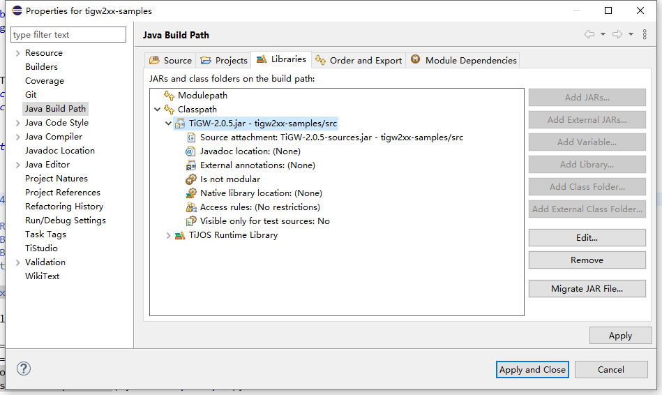
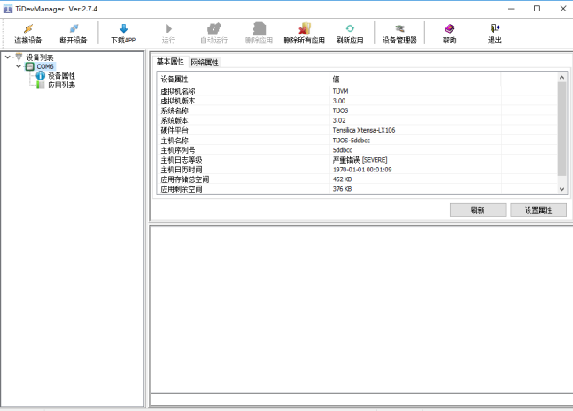
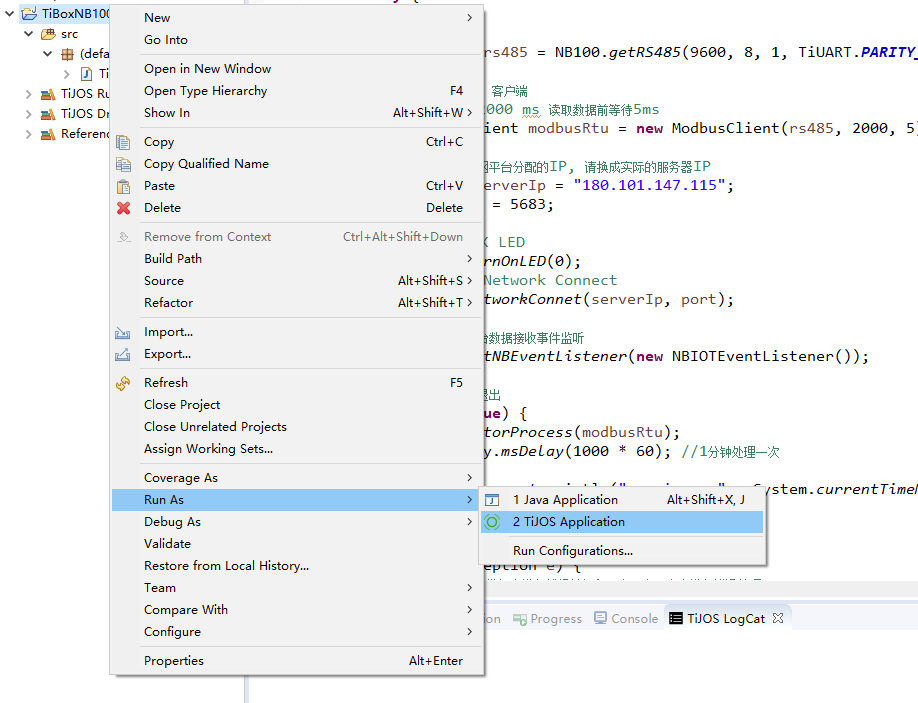

# 


# TiGW260可编程4G网关(带音频输出)开发指南


## 目 录

[TOC]


## 产品介绍 

TiGW260是钛云物联基于钛极OS(TiJOS)物联网操作系统开发的TiGW200系列的支持音频输出的4G可编程边缘计算网关，用户可通过Java语言开发控制器内部的应用和控制逻辑以及与云平台交互过程， 同时它支持音频输出，可外接音箱扬声器及开关型声光报警器，适用于需要支持音频输出的场景。

以下介绍如何在TiGW260网关进行应用开发, 更多内容可参考相关例程及钛OS(TiJOS)文档中心 http://doc.tijos.net

 

##  准备开发环境

### 安装TiStudio

在进行开发之前 ，请先安装Eclipse开发环境及TiStudio开发插件，请参考如下链接进行开发环境的安装。 

[开发环境搭建与开发板测试 - 文档中心 (tijos.net)](http://dev.tijos.net/docstore/tijos-development-course2/introductory/LESSON3/tistudio_and_tikit_verification/)

### 创建TiJOS Application工程

TiGW200提供了相关例程，用户可直接使用Eclipse打开例程进行修改或者新建一个TiJOS Application工程，具体过程请参考[欢迎来到TiJOS世界—新建工程Hello TiJOS - 文档中心](http://dev.tijos.net/docstore/tijos-development-course2/introductory/LESSON5/hello_tijos/)

TiGW200提供了两个JAR包，TiGW200-2.0.x.jar是依赖库， TiGW200-2.0.x-sources.jar 是对应的源码，方便用在Eclipse中直接查看对应的库中的源码。

在新建工程后， 将TiGW200-2.0.x.jar加入到工程中， 将在工程属性中将该Jar包加入到Java Build Path中，同时可将源码包加到配置中， 如下图所示：



关联库的源码


双击Source attachement或点击Edit按钮


选择对应的TiGW200-2.0.X-sources.jar包文件即可。 

当需要时， 在工程中双击对应的class文件即可看到对应的源码


### 编码

此时，即可在Eclipse中进行相应的代码编写。

### 连接设备

通过USB口连接设备，在Eclipse中打开TiDevManager

#### TiDevManager设备管理器

TiDevManager设备管理器是钛极OS(TiJOS)开发套件TiStudio的组成部分， 用于查看设备信息及应用管理的工具，也可单独运行，详细使用方法请参考[初识TiDevManager设备管理器 - 文档中心 (tijos.net)](http://dev.tijos.net/docstore/tijos-development-course/step2-device_manager/about_tidevmanager/)

TiDevManager可通过Eclipse的菜单启动。


启动后， 可连接设备查看设备及应用信息



连接成功后， 可查看到设备相关信息， 如果连接失败，请确认设备内是否有应用已设置为自动运行， 此时可通过按下FN键并重新上电，切换到开发模式下重新连接。

### 下载、运行

代码无误后， 可通过Run As菜单选择"TiJOS Application"运行， 在运行之前请确保已正确连接在TiBOX的USB编程口， 可从TiJOS LogCat中查看日志或打开TiDevManager查看日志。



### 导出应用tapk

在完成开发测试后，可导出应用tapk文件，通过钛极智能网关批量设置工具快速完成配置，具体可参考钛极智能网关批量设置工具用户手册。

##  TiGW260  编程开发说明

TiGW260 内置钛极OS(TiJOS) 操作系统， 支持通过Java语言进行应用开发，可通过钛极OS(TiJOS) 开发工具链IDE进行应用开发， 钛极OS(TiJOS)在线文档可参考 doc.tijos.net

### TiGW260 Java类使用说明

#### 外设访问

tigateway.TiGW260类提供了TiGW260所支持的硬件资源访问， 包括RS485, LED等，用户可通过在TiStudio中进行简单的开发即可支持各种应用， 同时提供了的MODBUS协议类， 可以很方便地与支持MODBUS RTU协议的设备进行数据交互。 

##### RS485

TiGW260支持1路RS485,支持最大驱动32个RS485从设备。 

##### 可控LED 

TiGW260提供1个红色电源指示灯和2个可编程控制LED灯，对应于蓝色和绿色， 方便用户在代码中指示设备的当前状态， 建议蓝色灯用于指示4G网络通讯状态， 绿色灯用于指示RS485通讯状态。

##### 音频输出

TiGW260提供了一路音频输出，用于外接扬声器，驱动能力1.5W, 8欧， 支持TTS 将文字转换为语音输出

##### 可控输出电源

为了方便用户连接RS485设备或开关型声光报警器， TiGW260提供一路可控输出电源，规格与输入电源一致，默认为关闭，需要时可通过代码打开。


## TiGW260 外设访问组件

为了方便用户在程序中访问外设， TiGW260提供了JAVA类开源组件，通过TiGW260.getInstance()获取TiGW260对象之后即可通过如下方法访问对应的外设。

| 方法                                                         | 说明                                                      |
| ------------------------------------------------------------ | --------------------------------------------------------- |
| **RS485**                                                    |                                                           |
| TiSerialPort getRS485(int baudRate, int dataBitNum, int stopBitNum, int parity) | 获取0通道RS485接口， 参数：波特率，数据位，停止位，校验位 |
| **LED灯**                                                    |                                                           |
| TiLED blueLED()                                              | 获取蓝色灯对象                                            |
| TiLED greenLED()                                             | 获取绿色灯对象                                            |
| **可控电源输出**                                             |                                                           |
| TiVout vout()                                                | 获取电源输出对象                                          |


### TiSerialPort  串口类主要方法使用说明

通过getRS485获取串口后，即可对串口进行读写操作

| 方法                                                        | 说明                                                         |
| ----------------------------------------------------------- | ------------------------------------------------------------ |
| void write(byte [] buffer ,int start ,int length)           | 写入数据到串口 buffer: 待写入数据  start  缓存区开始位置 length 写入长度 |
| int read(byte[] buffer, int start, int length, int timeOut) | 从串口读取指定长度数据,返回实际长度  buffer: 读入数据缓存区，start 缓存区开始位置 ，length 读取长度 ， timeOut超时，单位毫秒 |
| byte [] read(int msec)                                      | 从串口读数据, msec 最大毫秒数， 当有数据时从串口指定时间的数据返回， 如果没有数据则返回null |
| byte[] read()                                               | 从串口读数据, 有数据时立即返回读取到的数据，否则返回null     |
| void clearInput()                                           | 清除输入缓存区                                               |


### TiLED灯主要方法使用说明

通过blueLED/greenLED可以获取蓝灯和绿灯对象，并进行如下操作

#### 开灯turnOn

指定的灯亮

#### 关灯turnOff

指定的灯灭

#### 灯闪

可通过turnOn/turnOff组合实现灯闪效果， 为不影响主程序运行，也可启动一个专门的线程来实现闪烁的效果。


### TiVout电源输出主要方法使用说明

通过vout可以获取电源输出对象，并进行如下操作

#### 打开电源turnOn

接通输出电源

#### 关闭电源turnOff

断开输出电源


### TiTTS语音输出组件(Text to Speech)

**TTS是[Text To Speech](https://baike.baidu.com/item/Text To Speech)的缩写，即“从文本到语音”，是人机对话的一部分，让机器能够说话。** (来自百度百科)

通过TTS技术， 可以将文字转换为语音输出，从而达到人员提醒的目的。 

钛极OS内置TiTTS类来支持TTS功能， TiTTS为单例，在操作网络时可通过getInstance获得实例并调用相应的方法。

主要方法如下：

| 方法                          | 说明                         |
| ----------------------------- | ---------------------------- |
| TiTTS getInstance()           | 获取TTS实例                  |
| void play(byte[] soundStream) | 播放文字流-UTF8格式          |
| void forceStop()              | 停止播放                     |
| void setSpeed(int percent)    | 设置播放速度，0-100， 默认50 |
| void setVolume(int percent)   | 设置音量，0-100， 默认50     |
| void setPitch(int percent)    | 设置音高， 0-100， 默认50    |
|                               |                              |

注意：TTS中播放的文字流必须是UTF-8格式， 中文固定字符串播放可通过TiDevManager中的UTF8转换功能转换为数组进行播放， 通过网络或其它方式获取的字符串可预先转换为UTF-8格式之后发送到网关进行播放。

**TTS例程**

大多数情况下使用play即可满足需求

```java
...
//中文需转成UTF-8格式, 可通过TiDevManager中的utf-8转换功能
//微信收款 100 元 转换为UTF-8 byte 数组 
byte[] content = { (byte) 0xE5, (byte) 0xBE, (byte) 0xAE, (byte) 0xE4, (byte) 0xBF, (byte) 0xA1,
		(byte) 0xE6, (byte) 0x94, (byte) 0xB6, (byte) 0xE6, (byte) 0xAC, (byte) 0xBE, (byte) 0x20,
		(byte) 0x31, (byte) 0x30, (byte) 0x30, (byte) 0x20, (byte) 0xE5, (byte) 0x85, (byte) 0x83 };

//通过音频播放输出
TiTTS.getInstance().play(content);

```


## MODBUS 组件

Modbus 一个工业上常用的通讯协议, 其中MODBUS-RTU/MODBUS-ASCII在支持串口的设备中最为常用， 目前市面上很多设备和传感器都提供MODBUS-RTU/MODBUS-ASCII的协议支持。 

TiGW200提供了相应的MODBUS 组件方便用户在代码中直接访问MODBUS RTU和MODBUS ASCII设备, 在初始化时可根据RTU或ASCII协议创建相应的对象ModbusRTU/ModbusASCII.


### 主要接口

| 函数                                                         | 说明                                                         |
| ------------------------------------------------------------ | ------------------------------------------------------------ |
| ModbusRTU(TiSerialPort serialPort,  int timeout)             | ModbusRTU初始化构造函数，serialPort:  串口通讯对象， timeout: RS485设备通讯超时时间 |
| ModbusASCII(TiSerialPort serialPort,  int timeout)           | ModbusASCII初始化构造函数，serialPort:  串口通讯对象， timeout: RS485设备通讯超时时间 |
| **初始化寄存器请求**                                         | 根据参数构造MODBUS寄存器请求                                 |
| initReadCoilsRequest(int deviceId, int startAddress, int count) | 初始化Read Coils 请求, MODBUS功能码 0x01                     |
| initWriteCoilRequest(int deviceId, int coilAddress, boolean value) | 初始化WRITE COIL register 请求- 单寄存器操作， MODBUS功能码 0x05 |
| initWriteCoilsRequest(int deviceId, int startAddress, boolean[] values) | 初始化WRITE MULTIPLE COILS registers 请求- 多寄存器操作， MODBUS 功能码 0x15 |
| initReadHoldingsRequest(int deviceId, int startAddress, int count) | 初始化READ HOLDING REGISTERs 请求 , MODBUS功能码 0x03        |
| initReadDInputsRequest(int deviceId, int startAddress, int count) | 初始化READ DISCRETE INPUT REGISTERs 请求,  MODBUS功能码 0x02 |
| initReadAInputsRequest(int deviceId, int startAddress, int count) | 初始化READ INPUT REGISTERs 请求, MODBUS功能码 0x04           |
| initWriteRegisterRequest(int deviceId, int regAddress, int value) | 初始化WRITE SINGLE REGISTER 请求 - 单寄存器操作, MODBUS功能码 0x06 |
| initWriteRegistersRequest(int deviceId, int startAddress, int[] values) | 初始化WRITE MULTIPLE 请求 - 多寄存器操作, MODBUS功能码 0x10  |
| **执行请求**                                                 | 发送MODBUS请求到设备并获取返回数据                           |
| int execRequest()                                            | 执行MODBUS 请求并获得MODBUS响应结果                          |
| int getResponseAddress()                                     | 获取返回的MODBUS寄存器开始地址                               |
| int getResponseCount()                                       | 获取返回的MODBUS寄存器个数                                   |
| boolean getResponseBit(int address)                          | 获取指定地址COIL寄存器值， 对应于InitReadCoilsRequest/InitReadDInputsRequest |
| int getResponseInt16(int address, boolean unsigned)          | 获取指定地址InputRegister/HoldingRegister的值， unsigned: 返回值 为无符号或有符号整数 |
| int getResponseInt32(int address, boolean bigEndian)         | 获取指定地址InputRegister/HoldingRegister的连续2个寄存器值组成1个32位有符号整数， bigEndian:是否为大端格式 |
| float getResponseFloat(int address, boolean bigEndian)       | 获取指定地址InputRegister/HoldingRegister的连续2个寄存器值组成1个32位浮点数， bigEndian:是否为大端格式 |

#### 参数说明

**deviceId** - MODBUS 设备地址

**startAddress** - MODBUS 寄存器开始地址

**count** - 寄存器个数 

**regAddress** - MODBUS 寄存器地址


### 调用过程

MODBUS 组件的调用过程一般为：

1. 指定串口实例化MODBUS对象，如果是MODBUS RTU协议设备：ModbusRTU(TiSerialPort serialPort,  int timeout)， 如果是MODBUS ASCII设备：ModbusASCII(TiSerialPort serialPort,  int timeout)

2. 初始化MODBUS寄存器读写操作请求， initXXXRequest 

3. 执行MODBUS请求并返回结果 execRequest

4. 根据设备协议中定义的数据类型获取返回的寄存器值 getResponseBit/getResponseInt16/getResponseInt32/getResponseFloat


| MODBUS 功能码 | 对应的初始化请求接口      | 说明           |
| ------------- | ------------------------- | -------------- |
| 0x01          | initReadCoilsRequest      | 请取线圈状态   |
| 0x02          | initReadDInputsRequest    | 读取输入状态   |
| 0x03          | initReadHoldingsRequest   | 读取保持寄存器 |
| 0x04          | initReadAInputsRequest    | 读取输入寄存器 |
| 0x05          | initWriteCoilRequest      | 强置单线圈     |
| 0x06          | initWriteRegisterRequest  | 预置单寄存器   |
| 0x0F          | initWriteCoilsRequest     | 强置多线圈     |
| 0x10          | initWriteRegistersRequest | 预置多寄存器   |

### 例程

**场景**：

设备通过RS485连接到TiGW260， 通讯MODBUS RTU协议进行数据交互

**设备通讯参数**

| 参数    | 值   |
| ------- | ---- |
| 设备 ID | 1    |
| 波特率  | 9600 |
| 数据位  | 8    |
| 停止位  | 1    |
| 校验位  | 无   |

**寄存器**： INPUT REGISTER  (03)  

| 寄存器地址 | 内容     | 操作权限 | 数值范围                                           |
| ---------- | -------- | -------- | -------------------------------------------------- |
| 0x0000     | 空气湿度 | 只读     | 0x00(0)--0x03E7(999) 对应 0%--99.9% 数值放大了10倍 |
| 0x0001     | 空气温度 | 只读     | 0x8190(-400)--0x0320(800) 对应 -40℃--80℃ 负数      |


#### 代码调用过程

1. 打开RS485并获取TiSerialPort对象

   ```java
   TiGW260 gw260 = TiGW260.getInstance();
   //获取RS485 
   TiSerialPort rs485 = gw260.getRS485(9600,8,1,0);
   ```

2. 创建MODBUS协议对象并挂接RS485

  ```java
   //MODBUS 客户端  
   //通讯超时2000 ms 
   ModbusRTU modbusRtu = new ModbusRTU(rs485, 2000);
  ```

3. 通过MODBUS协议读取寄存器数据 

   ```java
      // MODBUS device address 设备地址
      int deviceId = 1;
      // Input Register 寄存器开始地址
      int startAddr = 0;
      // Read 2 registers from start address 读取个数
      int count = 2;
      
     //初始读取Holding Register参数， 设备地址， 寄存器开始地址， 个数
      modbusRtu.initReadHoldingsRequest(deviceId, startAddr, count);
      int result = modbusRtu.execRequest();
      
      //读取成功进行数据解析
      if (result == ModbusClient.RESULT_OK) {
          //获取第1个寄存器值 - 温度
      	int temperature = modbusRtu.getResponseInt16(startAddr, false);
          //获取第2个寄存器值 - 湿度
      	int humdity = modbusRtu.getResponseInt16(startAddr + 1, false);
      }
   ```


## 网络访问

TiGW260支持 4G Cat1网络， 基于运营商现有的手机网络即可接入云平台。 

用户可通过钛极OS运行库中TiLTE来进行4G Cat1网络的控制， 在程序运行开始通过startup来启动网络即可。 

### LTE网络设置 - TiLTE

TiLTE中包含了所有与LTE网络相关的操作和设置 
TiLTE为单例，在操作网络时可通过getInstance获得实例并调用相应的方法。

主要方法如下：

| 方法                                            | 说明                                               |
| ----------------------------------------------- | -------------------------------------------------- |
| TiLTE getInstance()                             | 获取LTE实例                                        |
| void startup(int timeout)                       | 启动LTE并连接基站, timeout以秒为单位               |
| void startup(int timeout, ILTEEventListener lc) | 启动LTE并连接基站， 当基站连接或断开时通过事件通知 |
| void shutdown()                                 | 关闭LTE                                            |
| String getIMEI()                                | 获取模组IEMI字符串                                 |
| String getIMSI()                                | 获取SIM卡IMSI字符串                                |
| void getICCID()                                 | 获取SIM卡CCID字符串                                |
| String getPDPIP()                               | 获取当前IP地址                                     |
| int getRSSI()                                   | 获取当前信号强度                                   |
| TiLTECell getCellInfo()                         | 获取基站信息， 可用于基站定位                      |

TiLTE类中他方法的技术说明请参考TiJOS Framework说明文档。


源码请参考： https://github.com/TiJOSteam/TiGW200-Cat1/blob/main/SDK/sample/modbus-rtu/src/LTENetworkSample.java


## 云端接入

TiGW200内置钛极OS(TiJOS)物联网操作系统, 不仅支持Java标准socket， 同时也提供各种云平台接入专用组件, 包括MQTT, CoAP, LWM2M, 阿里云，腾讯云等等， 同时也可接入其它支持相关技术的云平台，可参考相应的例程。

### 云平台接入组件

tijos.framework.networkcenter

TiJOS 网络中心包括如下包：

| 包名称                                | 说明                                |
| ------------------------------------- | ----------------------------------- |
| tijos.framework.networkcenter.mqtt    | MQTT客户端支持包，支持MQTT3.1.1标准 |
| tijos.framework.networkcenter.http    | HTTP 客户端                         |
| tijos.framework.networkcenter.coap    | COAP 客户端                         |
| tijos.framework.networkcenter.lwm2m   | LWM2m客户端                         |
| tijos.framework.networkcenter.alibaba | 阿里云物联网平台客户端              |
| tijos.framework.networkcenter.tencent | 腾讯云IoT Explore物联网平台客户端   |


### 云端接入例程

钛极OS(TiJOS)提供了各种例程方便用户快速接入各种平台，相关例程请参考如下链接

[软件应用相关例程 - 文档中心 (tijos.net)](http://dev.tijos.net/docstore/tijos-samples/tijos_docs_soft_sample/)

#### TiJOS JDK 常用功能例程

TiJOS JDK与标准Java JDK兼容，本目录下列出了一些基于标准java类的常用例程，方便用户参考

| 目录                  | 说明                                     |
| --------------------- | ---------------------------------------- |
| helloworld            | Hello TiJOS                              |
| datatype\BitOperation | java下的位操作及移位操作例程             |
| math                  | 常用数据函数例程，加减乘除，三角函数等等 |
| file                  | 文件操作例程，文件创建删除，读写等等     |
| thread                | 多线程例程，经典生产者消费者例程         |
| network\NTP           | 基于NTPUDPClient的网络时间协议例程       |
| network\tcp_client    | 基于SOCKET的TCP 客户端例程               |
| network\tcp_server    | 基于ServerSocket和Socket的TCP服务器例程  |
| network\udp           | 基于DatagramSocket的UDP例程              |
| network\dns           | 基于InetAddress的DNS例程                 |
| base64                | BASE64编码解码例程                       |
| json                  | JSON字符串生成和解析例程                 |
| MQTT                  | 基于MqttClient的MQTT客户端例程           |
| Alibaba               | 阿里云物联网平台例程                     |
| Tencent               | 腾讯云物联网平台例程                     |


## 应用远程升级OTA

钛极OS(TiJOS)提供了基于HTTP的远程OTA应用升级方案及源码，方便用户快速在代码中加入远程升级支持， 具体可参考https://github.com/TiJOSteam/tijos-http-ota


## 关于Exception

Exception是JAVA语言的最常用的错误处理方式， 为了适用低资源设备，钛极OS在编译过程中会将类、方法名称简化为ID，在打印Exception时只能看到相关的ID， 如果需要查看ID与相应的类名称的对应关系， 可通过在导出TAPK的来查看，此时在Eclipse的编译输出中可以看到所有的类及方法对应的ID，从而方便快速查错。 

#### 导出TAPK


导出成功后， 即可在Eclipse的Console日志中看到相关的类及方法对应的ID,如下图所示


## 常见Exception

由于系统资源的限制，钛极OS在产生异常并打印时显示异常Class 名称为ID， 该ID对应的异常类名称可通过导出Tapk应用文件时显示的日志信息中查看， 下面是标准库中支持常见Java Exception及对应的ID号，当产生Exception时可通过Class ID 对应的Exception来判断具体原因。 

| Java Exception                            | Class ID | 说明                                                         |
| ----------------------------------------- | -------- | ------------------------------------------------------------ |
| java.lang.OutOfMemoryError                | 3        | 内存不足，建议在代码中不要建立大量一直使用的对象             |
| java.lang.NoSuchMethodError               | 14       | 类中无此方法                                                 |
| java.lang.StackOverflowError              | 15       | 线程堆栈溢出，一般为内存不足                                 |
| java.lang.NullPointerException            | 16       | 空指针                                                       |
| java.lang.ClassCastException              | 26       | 强制类型转换异常                                             |
| java.lang.ArithmeticException             | 27       | 数学运算异常， 如除0                                         |
| java.lang.ArrayIndexOutOfBoundsException  | 28       | 访问数组越界                                                 |
| java.lang.IllegalArgumentException        | 29       | 非法参数异常                                                 |
| java.lang.InterruptedException            | 30       | 线程阻塞方法收到中断请求时发生此异常                         |
| java.lang.IllegalStateException           | 31       | 非法状态异常                                                 |
| java.lang.IllegalMonitorStateException    | 32       | 非法的监控状态异常，当某个线程试图等待一个自己并不拥有的对象时发生 |
| java.lang.ArrayStoreException             | 34       | 数组元素类型不匹配异常                                       |
| java.lang.NegativeArraySizeException      | 35       | 试图创建大小为负的数组，则抛出该异常                         |
| java.lang.CloneNotSupportedException      | 64       | 在没有实现`Cloneable` 接口的实例上调用 Object 的 clone 方法  |
| java.lang.RuntimeException                | 71       | 运行时异常                                                   |
| java.lang.IndexOutOfBoundsException       | 72       | 访问数组越界                                                 |
| java.lang.Exception                       | 73       | 异常                                                         |
| java.lang.StringIndexOutOfBoundsException | 77       | 访问字符串越界                                               |
| java.lang.UnsupportedOperationException   | 79       | 不支持的操作                                                 |
| java.io.IOException                       | 91       | IO异常                                                       |
| java.lang.NumberFormatException           | 93       | 数字格式异常                                                 |
| java.io.UnsupportedEncodingException      | 99       | 不支持字符编码                                               |
| java.util.NoSuchElementException          | 149      | 无此元素                                                     |


## 代码定位

当发生Exception时， 可通过printStackTrace来输出调用栈， 在调用栈中会打印出相应的ClassNo, MethodNo,MethodPc, 通过这三个参数来定位具体的发生位置。

点击Exception query弹出相应的窗口


选择对应的项目， 并输入位置信息，点击Query即可看到相应的位置信息， 如果有源码，点击Go即可定位到具体位置。 


## 技术支持

如果您有任何技术问题，可通过电话，微信， QQ群等方式与我们联系， 同时钛云物联可提供产品定制，通讯协议开发，云端接入，技术培训等多种服务。

## 更多资源

TiGW200是钛云物联的钛极OS(TiJOS)物联网操作系统的一个典型应用， 关于钛极OS(TiJOS)物联网操作系统可参考如下资源：

| 资源                                     | url                                               |
| :--------------------------------------- | ------------------------------------------------- |
| 钛极OS官网                               | [www.tijos.net](http://www.tijos.net)             |
| 钛极OS文档中心                         | [doc.tijos.net](http://doc.tijos.net)      |
| 微信公众号 - 钛极OS    |             |


## 联系方式

北京钛云物联科技有限公司

商务合作：13911058165

品牌热线：010-86462928

公司网址：www.tijos.net

电子邮件：tijos@tijos.net     

在线购买: https://shop423269048.taobao.com/

