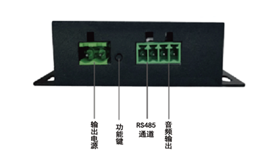

# TiGW260可编程4G网关(带音频输出)用户手册

## 产品介绍

TiGW260是钛云物联开发的支持4G Cat1网络的可编程支持音频输出网关,它提供1路RS485，1路音频输出，1路可控开关电源，支持音频输出，支持TTS(Text to Speech), 可通过目前的运营商4G网络将数据上报至云端,满足用户对设备的接入需求, 能够支持目前主流的网络接入协议和公有云平台，包括MQTT, COAP, LWM2M以及阿里云、腾讯云、中国移动ONENET、中国电信AEP等等。

TiGW260内置钛云物联自主知识产权的钛极OS(TiJOS)物联网操作系统，支持用户通过Java语言进行功能扩展，适用各种工况， 它强大的可编程功能允许用户根据项目需求通过Java语言开发相关所需的功能， 如串口通讯， 协议解析，上传云端等等。

TiGW260提供了丰富的文档和例程，并提供了大量开源驱动，如MODBUS等，方便用户可以快速的完成所需功能。

 

### 产品特点

- 支持4G LTE网络，支持中国移动， 中国电信， 中国联通全网通频段
- 支持1路RS485工业总线接入现场设备 
- 提供1路Vout可控电源输出，可用于控制开关型声光报警器
- 提供1路音频输出，支持TTS语音输出
- 内置TiJVM Java虚拟机
- 支持用户进行功能扩展
- 支持通过Java语言进行设备协议解析及控制策略
- 提供标准协议库，如Modbus等等
- 用户可内置多个应用对应不同的应用场景
- 支持UDP, TCP, HTTP, MQTT, COAP, LWM2M等多种网络协议
- 支持多种云平台, 如电信云,华为云,阿里云、腾讯云等公有云, 以及用户私有云
- 支持应用OTA, 可通过云端进行应用动态更新和加载 

## 产品规格

| 参数             | 说明                                           |
| ---------------- | ---------------------------------------------- |
| 产品名称         | 4G可编程音频网关                               |
| 产品型号         | TiGW260                                        |
| 工作电压         | 9-28V                                          |
| 供电方式         | 直流电源                                       |
| 无线传输方式     | 4G Cat1                                        |
| 有线传输方式     | 1路RS485, 最大支持32个设备连接                 |
| 音频输出         | 1路音频输出端子(驱动能力：1.5W,8欧姆)，支持TTS |
| 电源输出         | 可控电源输出，与电源输入相同，默认关闭         |
| 最大应用支持个数 | 32                                             |
| 串口波特率       | 2400~115200bps                                 |
| 编程端口         | USB                                            |
| 频段(MHz)        | 全网通                                         |
| SIM卡规格        | 标准SIM卡                                      |
| 通信天线         | SMA天线接口                                    |
| 外形尺寸         | 长82mm 宽62mm 高20mm (不含天线)                |
| 工作温度         | -35°C ~ +75°C                                  |
| 工作湿度         | 5%~95%(无凝露)                                 |
| 外壳材料         | 金属                                           |
| 配件             | 12V电源(1A)，USB数据线， 胶棒天线              |

## 接口说明

### 有线数据接口

#### 1路RS485

提供了1路RS485， 方便用户连接外部设备，连接时请注意RX和TX的线序。

#### 1路音频输出

提供1路音频输出，可连接外置扬声器

#### 输出电源(可控直流)

提供了一路电源输出接口，规格与输入电源相关， 可用于连接外部传感器设备或连接开关报警器， 该电源默认关闭，使用时根据需要在代码中打开或关闭，可用于控制开关型声光报警器或RS485设备电源输入

#### USB编程口

提供了一个USB串口编程口， 同时也可作为电源， 要通过TiDevManager设备管理连接该编程口后进行设备信息查看，应用管理等功能， 同时该编程口也是应用的日志输出口，用于进行应用测试和诊断。

### 无线数据接口

#### 4G Cat1

TiGW200提供4G Cat1数据接口，在插入4G物联卡后即可接入4G 网络。 

### 其它

#### 直流电源输入接口(5.5*2.1圆形接口)

使用提供的12V直流电源(1A)连接该接口

**为了防止损坏，请不要频繁接插电源，断电后应2S后再上电** 

#### SIM卡槽

用于放置4G SIM卡

#### SMA天线底座

SMA接口天线底座， 请使用SMA内螺内针4G天线。

#### 功能键

功能键用于将设备进入开发状态，当用户应用开发完成并设置为自动运行后将进入用户应用状态，此时TiDevManager工具无法进行管理。 当用户需要通过TiDevManger进行设备管理或更新内部应用时，需要通过功能键来进入开发状态，具体操作如下：

1. 按住功能键
2. 重新插拔电源
3. 松开功能键

此时设备即进入开发状态， 即可使用TiDevManager进行设备管理或应用开发。

**注**：如果用户处于开发状态， 希望停止当前运行的用户应用时，只需要重新插拔电源即可。

#### LED灯

可编程控制的LED灯， 可在应用中根据实际情况来对LED进行打开，关闭，闪烁等操作。

## 设备连接

在进行测试前可按如下步骤进行硬件准备工作。

### 安装天线

将配件中的天线安装到天线底座。

### 安装4G物联网卡

推出SIM卡槽后将SIM卡放入后推入。

### 通过RS485连接设备

将RS485端口连接到设备进行测试。

### 连接电源

通过直流电源接口连通电源。 

### 应用开发

完成连接后， 即可通过钛极OS提供的工具链进行控制器内的应用开发，具体请参考<TiGW200可编程边缘计算网关开发指南>.

## 应用运行方式

### 上电自动运行

设备最大支持32个用户应用， 同时用户可选择其中一个应用设置为上电自动运行，设置之后设备在上电后即可启动该应用。

具有自动运行属性的应用程序在系统启动时自动启动，任何应用程序都可以设置为自动运行属性，系统默认的自动运行程序为ID=0的应用程序(**shell**)，该应用程序为钛极OS(TiJOS)系统**预装的终端程序**，用户无权删除，用户可通过TiDevManager设备管理器下载应用程序、更改系统配置等。

当用户应用开发测试完成后，可以设置为上电自动运行作为正式产品。

### 停止应用并进入可编程状态

**场景1：**

当某个用户应用设置为上电自动运行后，只能通过功能键来进入可编程状态， 操作过程请参考功能键说明，即按住功能键同时重新上电即可， 此时即可进行应用编程， 或通过TiDevManager设备管理器修改自动运行的用户程序，如果不做修改，重新上电后仍然会自动运行该用户程序， 可将设置ID为0的ti-shell-xxx应用为上电自动运行来恢复默认，之后重新上电后即进入可编程状态。

**为了防止损坏，请不要频繁接插电源，断电后应2S后再上电** 

**场景2：**

用户未设置上电自动运行，在开发测试过程中有可能在代码中使用While(true)等方式进入死循环避免程序中途退出或希望随时停止应用，此时通过重新上电即可进入可编程状态并重新运行即可。

## 更多资源

| **名称**               | **资料链接地址**                                             | **说明**                                |
| ---------------------- | ------------------------------------------------------------ | --------------------------------------- |
| TiGW200  SDK           | https://github.com/TiJOSteam/TiGW200/tree/main/SDK           | 包含开发指南、硬件访问API、基础例程等等 |
| Eclipse开发环境搭建    | http://doc.tijos.net/docstore/tijos-development-course/step1-enviornment_setup/about_tistudio/ | 基于Eclipse的开发环境搭建流程           |
| 钛极OS文档中心         | http://doc.tijos.net/docstore/                               | 钛极OS开发文档及例程                    |
| MODBUS例程             | https://github.com/TiJOSteam/TiGW200/tree/main/SDK/sample/tigw2xx-samples/modbus-rtu | Modbus  及RS485例程                     |
| Text to Speech 例程    | https://github.com/TiJOSteam/TiGW200/tree/main/SDK/sample/tigw2xx-samples/tigw260/Text2SpeechSample.java | TTS音频输出例程                         |
| 可控电源输出例程       | https://github.com/TiJOSteam/TiGW200/tree/main/SDK/sample/tigw2xx-samples/tigw260/VoutSample.java | 可控电源输出控制                        |
| MQTT等基本例程         | https://github.com/TiJOSteam/tijos-software-example          | 标准MQTT接入例程                        |
| 阿里云接入例程         | https://github.com/TiJOSApp/tijos-mqtt-aliyun-iot            | 阿里云IoT平台接入例程                   |
| 腾讯云接入例程         | https://github.com/TiJOSApp/tijos-tencent-iot-explore        | 腾讯云IoT平台接入例程                   |
| 中国移动OneNET接入例程 | https://github.com/TiJOSApp/tijos-mqtt-onenet-iot            | 中国移动OneNET接入例程                  |

## 联系方式

北京钛云物联科技有限公司

商务合作：13911058165

品牌热线：010-86462928

公司网址：www.tijos.net

电子邮件：tijos@tijos.net     

在线购买: https://shop423269048.taobao.com/

