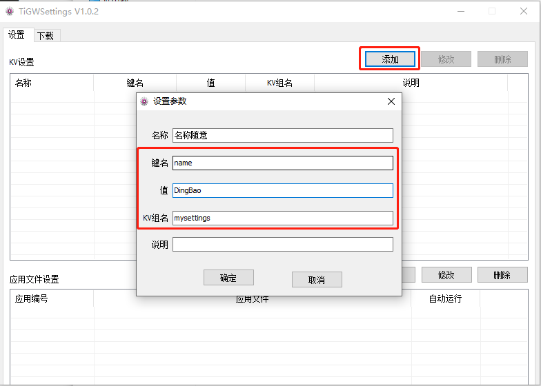
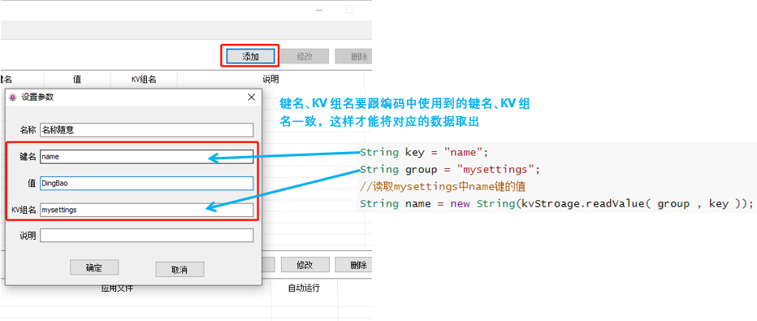
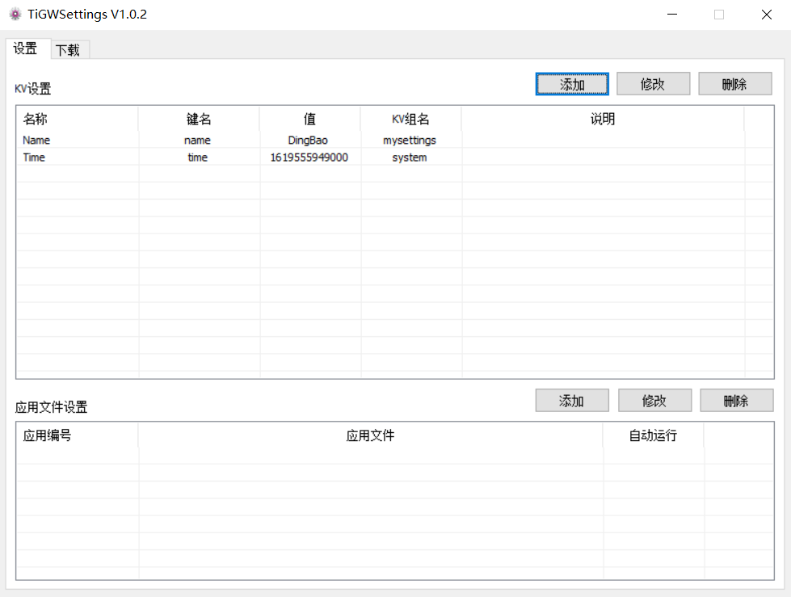
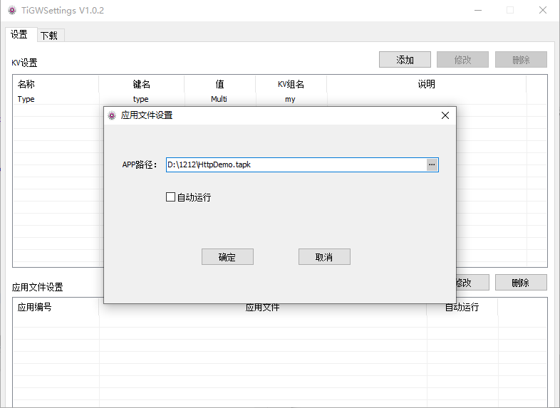
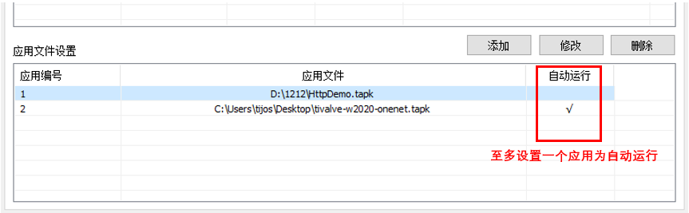
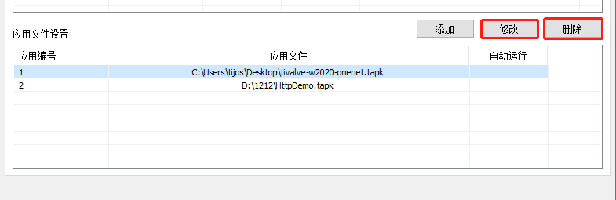
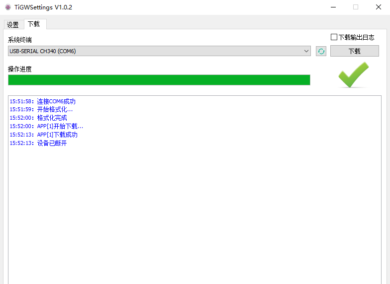

# 钛极智能网关批量设置工具

[TOC]


## 简介

钛极智能网关批量设置工具用于在开发完成后，将一个或多个钛极OS应用tapk应用批量下载到网关中并进行键值设置，快速完成相应的网关配置。

钛极智能网关内置KV数据库，通过键值对的方式保存用户设置，当设备重新上电时存储在设备中的参数不会被擦除, 数据不丢失,  用户可在代码中读取设置并执行相应的业务逻辑。 

该工具将开发阶段和部署阶段分离，开发人员只需完成钛极智能网关的开发和测试，由部署人员完成现场设备的安装和配置。 

## 准备工作

### 导出应用tapk

开发人员在Eclipse TiStudio中完成开发后导出应用tapk文件，可在Eclipse指定工程上右键点击弹出的菜单中选择"Export"来导出，如下所示：


选择TiJOS Development下的Export TiJOS Application Package:


根据向导导出tapk文件即可，可参考：[欢迎来到TiJOS世界—新建工程Hello TiJOS - 文档中心](http://dev.tijos.net/docstore/tijos-development-course2/introductory/LESSON5/hello_tijos/#_5)

### 将网关设置为可编程状态

一般通过按住功能键同时重新上电即可将网关进入可编程状态，当用户应用在运行时，批量设置工具是无法连接到设备的

### 定义用户配置KV键值对

钛极智能网关内置KV数据库用于存放用户配置， 用户可以在代码中读取或更新KV值来完成对应的业务处理。

#### 参考代码

```java
KeyValueStorage kvStroage = KeyValueStorage.getInstance();
//分组名
String group = "mysettings";
//键名
String key = "name"; 

//读取分组mysettings中name键的值
String name = new String(kvStroage.readValue( group , key ));
//读取分组system中time键的值
long time = LittleBitConverter.ToUInt64(kvStroage.readValue("system", "time"), 0);
System.out.println("time：" + time + "   name" + name);
```


## 批量下载设置

### 键值对KV设置

在KV设置中点击“添加”，设置参数



注意：**如图键名、KV组名要跟编码中使用到的键名、KV组名一致，这样才能将对应的数据取出**



2.如果添加有误，可选中该条KV点击“修改“或”删除“



### 应用文件设置

在应用文件设置中添加要下载的应用文件



**可以同时下载多个tapk文件、设置软件上电自动运行**

**注意：当要将应用设置为自动运行时最多只能设置一个tapk为自运行不能设置多个**



如果添加的tapk文件路径有误，可选中该条应用文件点击“修改“或”删除“



## 下载

完成相关设置后， 可在下载页签中将设置下载到网关设备中

连接网关设备，选择相应的COM口，点击右方下载即可



注意：网关设备需进入可编程状态，即未设置用户应用为自动运行

下载完成后，设备需要重新上电运行用户指定的应用tapk。

## 注意事项

1. 在下载时如果多次显示连接失败：

   a. 查看设备是否正在与其他工具连接，如果有断开与其他工具的连接

   b. 尝试重新上电，再连接 

   c. 按住key键，设备重新上电进入可编程状态再连接

